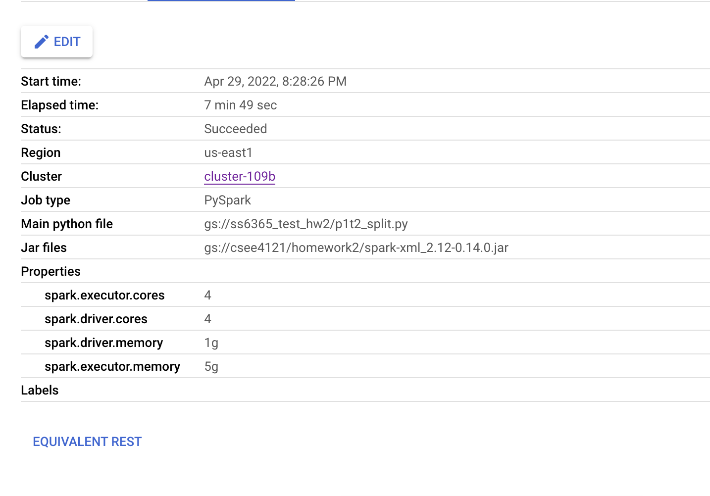
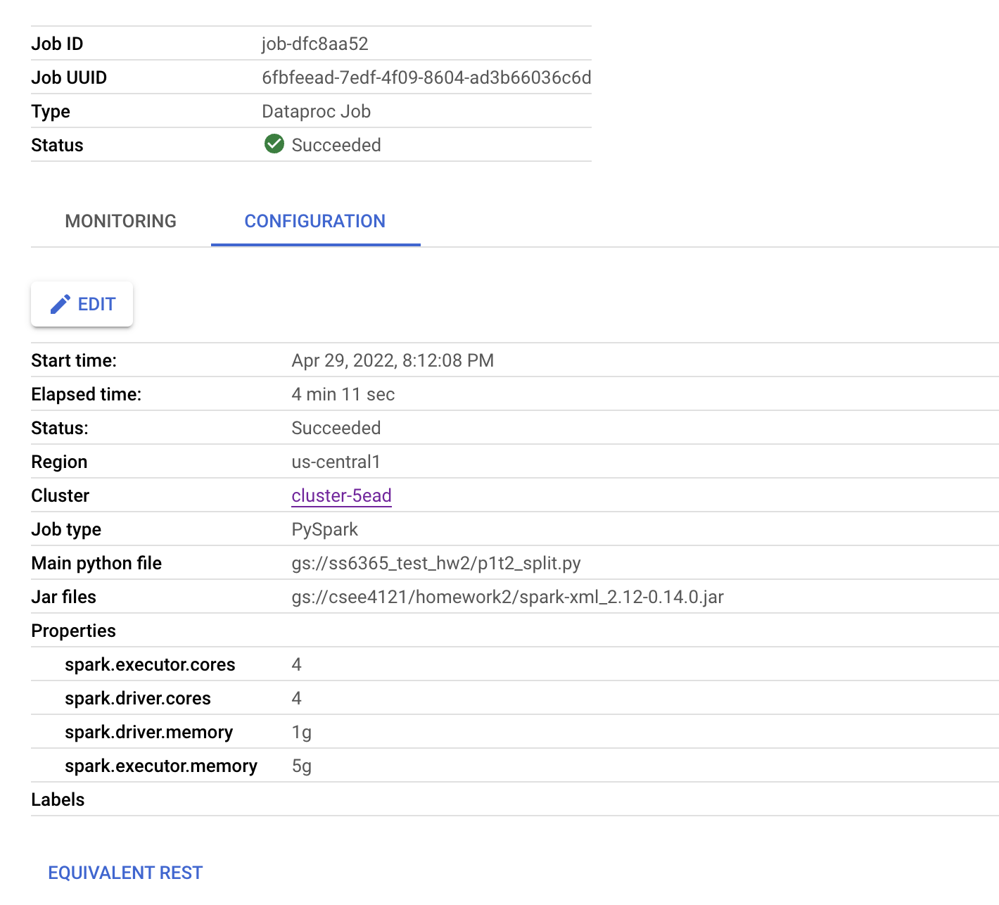
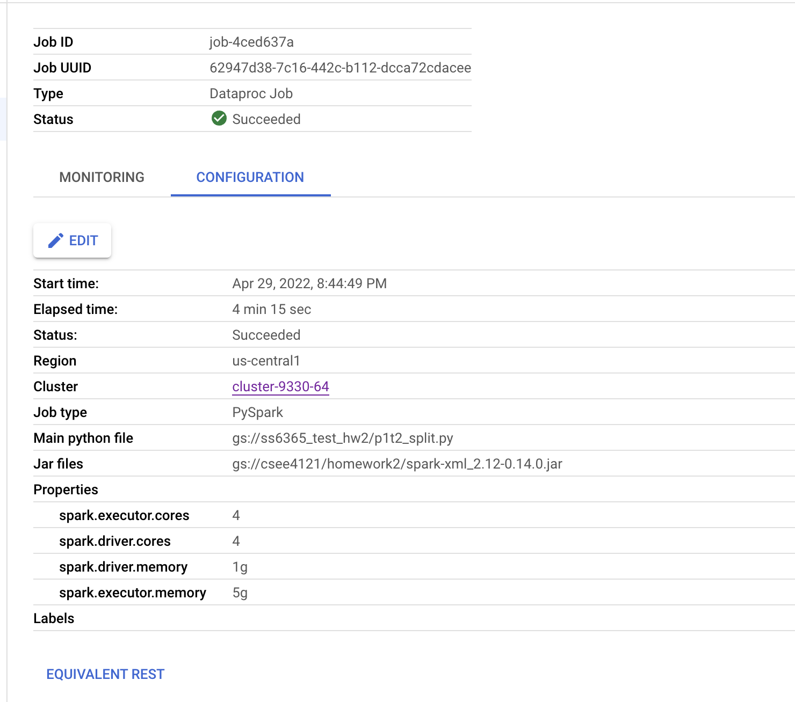
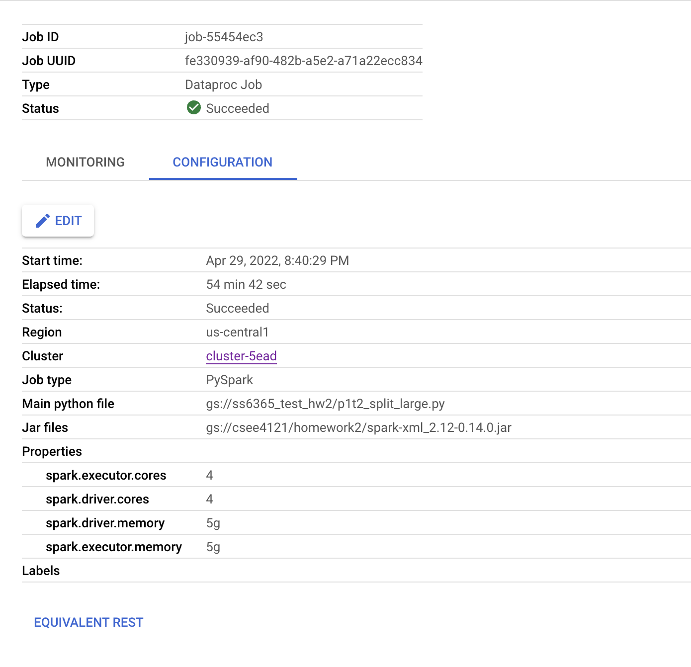
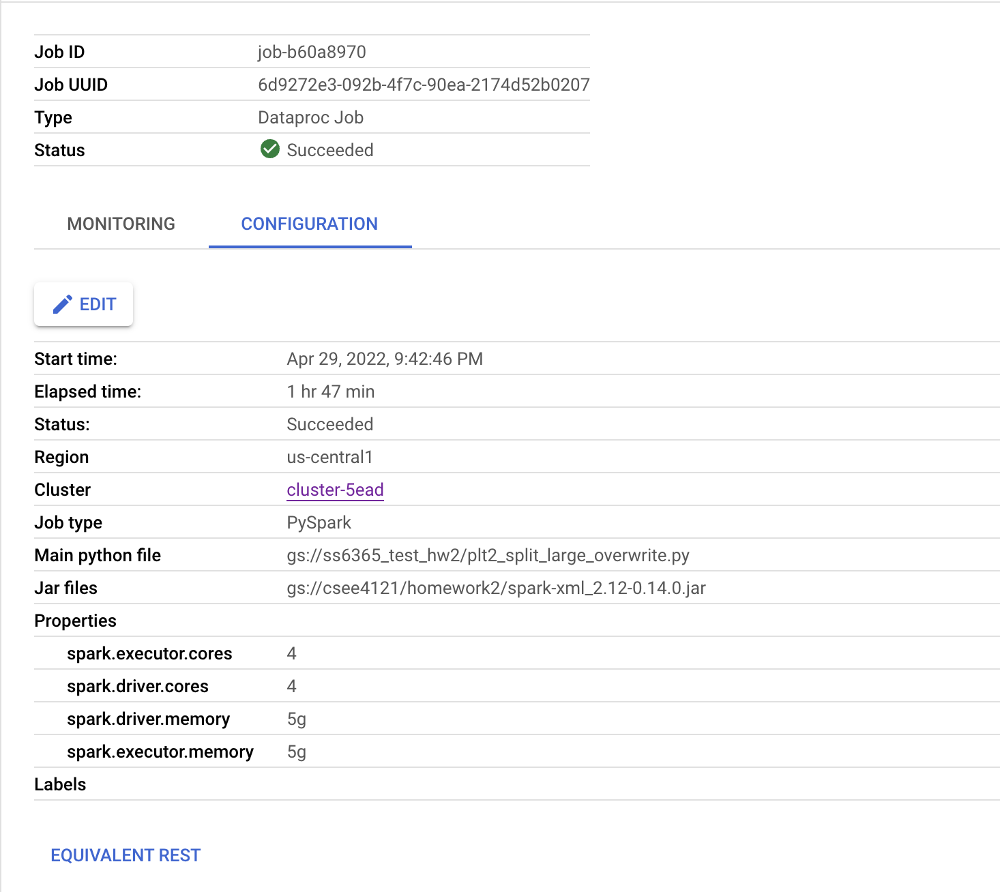
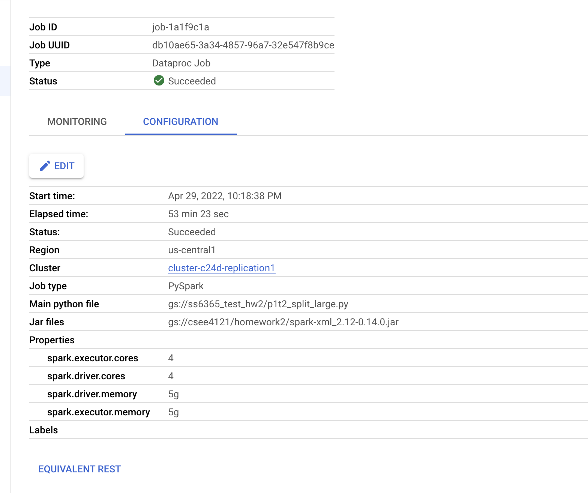
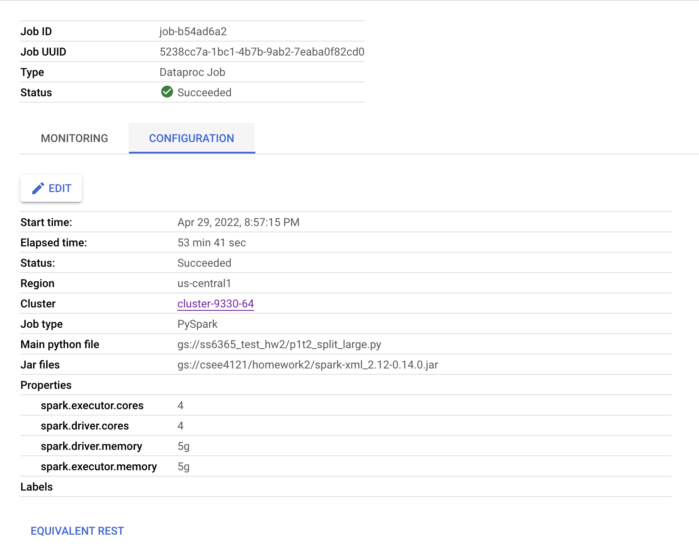
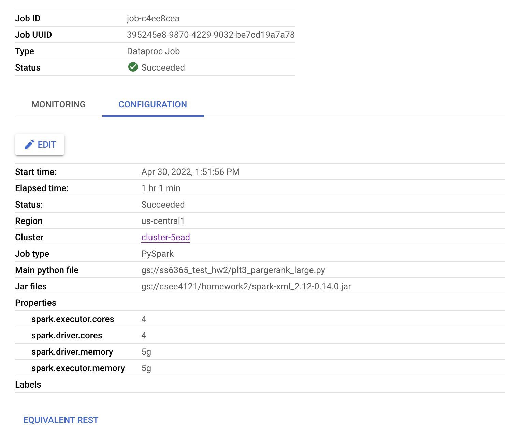

# PySpark_pagerank

In this assignment, Sai (ss6365) and Nickolo (nr2080) are working on a project to implement PageRank algorithm in PySpark.


## Question 1 

#### What is the default block size on HDFS? What is the default replication factor of HDFS on Dataproc?

The Default bloack size on HDFS for our instance is 128 MB. The default replication factor of HDFS on Dataproc is 2.

The Schema of the file is:

```
root
 |-- id: long (nullable = true)
 |-- redirect: string (nullable = true)
 |-- restrictions: string (nullable = true)
 |-- revision: struct (nullable = true)
 |    |-- comment: struct (nullable = true)
 |    |    |-- _VALUE: string (nullable = true)
 |    |    |-- _deleted: string (nullable = true)
 |    |-- contributor: struct (nullable = true)
 |    |    |-- id: long (nullable = true)
 |    |    |-- ip: string (nullable = true)
 |    |    |-- username: string (nullable = true)
 |    |-- id: long (nullable = true)
 |    |-- minor: string (nullable = true)
 |    |-- text: struct (nullable = true)
 |    |    |-- _VALUE: string (nullable = true)
 |    |    |-- _xml:space: string (nullable = true)
 |    |-- timestamp: timestamp (nullable = true)
 |-- title: string (nullable = true)
```

## Question 2 



## Question 3



## Question 4



## Question 5




## Question 6



## Question 7



## Question 8

